<div align="center">

<!-- Animated neon hero -->


<!-- Pixel bunny animation: DIMFLIX/DIMFLIX (MIT). See THIRD_PARTY_NOTICES.md. -->


<br/>


<br/>

<a href="https://github.com/Dung1424">
  
</a>

<a href="mailto:dangtiendung257@gmail.com">
  
</a>


<br/><br/>

<a href="#about-me"></a>
<a href="#tech-arsenal"></a>
<a href="#github-galaxy"></a>
<a href="#connect"></a>

</div>
<br/>

<div align="center">
  
</div>

<div align="center">
  
</div>

<a id="about-me"></a>

## `01 // ABOUT_ME`

<table>
<tr>
<td width="58%" valign="top">

### Hello, I'm Dũng 👋

I'm a full-stack developer from **Viet Nam 🇻🇳** who enjoys turning ambitious ideas into products people can actually use.

I care about clear architecture, thoughtful interfaces, and code that remains understandable after the excitement of launch day.

```javascript
const dung = {
  role: "Full Stack Developer",
  location: "Viet Nam 🇻🇳",
  focus: ["Web platforms", "Backend architecture", "UI experiences"],
  stack: ["Laravel", "Vue.js", "Node.js"],
  philosophy: "Learn → Build → Break → Fix → Improve → Repeat",
  poweredBy: "Coffee + curiosity ☕"
};
```

</td>
<td width="42%" valign="top">

### Current signal

- 🔭 Building modern, useful web applications
- 🧠 Exploring scalable backend architecture
- 🎨 Polishing frontend interactions
- 🧪 Experimenting with new tools and ideas
- 🌱 Improving one clean commit at a time

> **Mission:** make complex things feel simple.

</td>
</tr>
</table>

<div align="center">
  
</div>

## `02 // DEVELOPER_DNA`

<div align="center">

| `01` 🧩 **PROBLEM SOLVER** | `02` ⚡ **FAST LEARNER** | `03` 🎨 **CREATOR** | `04` 🚀 **BUILDER** |
|:---:|:---:|:---:|:---:|
| Turning complexity into practical solutions. | Treating every technology as a new world to explore. | Seeing code as logic shaped by creativity. | Giving ideas meaning by making them real. |

</div>

<div align="center">
  
</div>

<a id="tech-arsenal"></a>

## `03 // TECH_ARSENAL`

<div align="center">

### Frontend


### Backend


### Mobile · Data · Infrastructure


</div>

<br/>

<details>
<summary><b>⚙️ Open the full system inventory</b></summary>
<br/>

| Layer | Technologies |
|:--|:--|
| **Interface** | HTML, CSS, JavaScript, Vue.js, Nuxt.js, React, Next.js |
| **Server** | PHP, Laravel, Node.js, .NET, Spring |
| **Mobile** | Flutter, Dart |
| **Data** | MySQL, MongoDB, Redis, SQLite |
| **Operations** | Docker, Nginx, Linux, MinIO |
| **Workflow** | Git, GitHub |

</details>

<div align="center">
  
</div>

<a id="github-galaxy"></a>

## `04 // GITHUB_GALAXY`

<div align="center">


<br/><br/>


<br/><br/>


<br/><br/>


</div>

<div align="center">
  
</div>

## `05 // SNAKE_QUEST`

<div align="center">


<picture>
  <source media="(prefers-color-scheme: dark)" srcset="https://raw.githubusercontent.com/Dung1424/Dung1424/output/github-contribution-grid-snake-dark.svg"/>
  <source media="(prefers-color-scheme: light)" srcset="https://raw.githubusercontent.com/Dung1424/Dung1424/output/github-contribution-grid-snake.svg"/>
  
</picture>

</div>

<div align="center">
  
</div>

<a id="connect"></a>

## `06 // TRANSMISSION`

<div align="center">


### Have an interesting idea, challenge, or project?

I'm always open to learning, collaborating, and building something memorable.

<a href="mailto:dangtiendung257@gmail.com">
  
</a>
<a href="https://github.com/Dung1424">
  
</a>

<br/><br/>

`KEEP LEARNING`　•　`KEEP BUILDING`　•　`KEEP EXPLORING`

<br/>


</div>
